# okarina

ハックツハッカソン参加プロジェクト。
MIDIキーボード(Akai MPK Mini MK3)・オタマトーン(マイク入力)で演奏したメロディに
応じて、ゲーム世界の状態(扉の開閉・馬の召喚・ボスの撃破など)が変化する
「時のオカリナ」リメイク企画。3Dエンジンは既存ライブラリ(Three.js等)を使わず
Go+WebGLで自作している(詳細は`docs/tech-stack.md`参照)。

## ゲームの流れ

フィールドごとに別ページ・別WASMバイナリで構成されている。

```
index.html (title.wasm)
      ↓ MIDIで「ド」を弾く
temple.html (game.wasm) — 時の神殿。時の歌で隠し扉を開ける
      ↓ 扉を通過
grassland.html (grassland.wasm) — 草原。馬の歌で馬を呼び、柵をジャンプで越える
      ↓ 奥の木まで進む
ganon-hall.html (ganon-hall.wasm) — 玉座の間。光のプレリュードでGanon第一形態を撃破
      ↓ 崩落演出
ganon-battle.html (ganon-battle.wasm) — 戦場跡。嵐の歌でGanon最終形態を撃破
      ↓ 嵐→雷→爆発→白フェード
ending.html — エンディング(静的ページ)
```

各フィールドの実装内容の詳細は`docs/fields/`を参照。

## プロジェクト構成

```
/
├── cmd/
│   ├── title/         # タイトル画面 (title.wasm)
│   ├── game/          # 時の神殿フィールド (game.wasm)
│   ├── grassland/     # 草原フィールド (grassland.wasm)
│   ├── ganon-hall/    # ガノンフィールド・玉座の間案 (ganon-hall.wasm)
│   ├── ganon-battle/  # ガノンフィールド・戦場跡案 (ganon-battle.wasm)
│   └── gltfcheck/     # GLBファイルの読み込み検証用CLI(ブラウザ不要)
├── internal/
│   ├── assets/        # 3Dモデル・テクスチャ・音声を go:embed で埋め込むパッケージ
│   ├── bridge/        # JavaScript ⇔ Go WASM の相互呼び出しを仲介
│   ├── game/          # ゲーム全体のループ・状態管理・トリガー配線
│   ├── gltf/          # 自作 glTF/GLB パーサー
│   ├── midi/          # MIDI入力の受信
│   ├── music/         # メロディ(合言葉曲)の定義・照合ロジック
│   ├── player/         # プレイヤー(Link)の移動・状態
│   ├── renderer/      # 自作3Dエンジン(WebGL・シェーダー・メッシュ・シーン)
│   ├── vecmath/       # 3D数学(Vec3, Mat4)
│   └── world/          # フィールド状態(隠し扉の開閉)の管理
├── web/               # ブラウザ向け静的ファイル(HTML/JS, wasm_exec.js等)
├── docs/              # 設計メモ・技術スタック・アセットのライセンス
│   ├── tech-stack.md   # 実装ベースの技術スタック棚卸し
│   ├── fields/         # フィールドごとの実装ドキュメント
│   ├── licenses/        # 外部アセット(Sketchfab等)のライセンス記録
│   └── assets/          # ライセンス付きアセットの実体・プレビュー画像
├── go.mod
└── README.md
```

## セットアップ・ビルド

### 1. 全フィールドのWASMをビルド

```bash
for cmd in title game grassland ganon-hall ganon-battle; do
  GOOS=js GOARCH=wasm go build -o web/$cmd.wasm ./cmd/$cmd
done
```

`web/game.wasm`だけ更新したい場合は該当行だけ実行すればよい。

### 2. wasm_exec.js の配置(Goのバージョンを上げた時などは再実行)

Go 1.24以降は配置場所が `lib/wasm/` に変わっている(それ以前は `misc/wasm/`)。

```bash
cp "$(go env GOROOT)/lib/wasm/wasm_exec.js" web/wasm_exec.js
```

### 3. ローカルサーバーで配信

`fetch()` で `.wasm` を読み込むため、`file://` では動かない。
`web/` 直下でHTTPサーバーを立てる。

```bash
cd web
python3 -m http.server 8080
```

### 4. ブラウザで確認

`http://localhost:8080/index.html` を開く(タイトル画面から順にプレイする場合)。
特定のフィールドだけ確認したい場合は、対応する`.html`(`temple.html`,
`grassland.html`, `ganon-hall.html`, `ganon-battle.html`)を直接開いてもよい。

いずれのページも「音を有効にする」ボタンを一度クリックしてから
(ブラウザの自動再生ポリシーにより、ユーザー操作なしでは音が鳴らないため)
MIDI/マイク入力を試すこと。

### 5. ネイティブ実行(WASMに依存しない部分の疎通確認)

```bash
go run ./cmd/game
go test ./...
```

## 操作方法

- **MIDIキーボード**: Web MIDI APIで自動検出。鍵盤を弾くとNote On/Offイベントが
  `internal/midi`→`internal/music`へ渡り、登録済みのメロディと照合される。
- **オタマトーン(マイク入力)**: 「マイクを開始」ボタンでマイク入力の音程(自己相関法、
  `web/pitch.js`)を検出し、プレイヤーの前後移動に変換する。
- **デバッグ操作**: マイク・MIDIが無くても、矢印キー(→前進/←後退)や各フィールドの
  Oキー(扉を開ける・馬を呼ぶ・ジャンプ・各メロディを演奏したのと同じ効果、等)で
  一通り動作確認できる。各フィールドの画面下部にデバッグボタンも用意している。

### 現在定義されているメロディ(`internal/music/pattern.go`)

| 名前 | 音列 | 効果 |
|---|---|---|
| 時の歌 | ラ→レ→ファ→ラ→レ→ファ | 神殿の隠し扉を開ける |
| 馬の歌 | レ→シ→ラ→レ→シ→ラ | 草原に馬を呼び出す |
| 光のプレリュード | レ→ラ→レ→ラ→シ→レ | 玉座の間でGanon第一形態を撃破 |
| 嵐の歌 | レ→ファ→レ→レ→ファ→レ | 戦場跡でGanon最終形態を撃破 |

## 実装状況

- [x] MIDIデバイス接続・Note On/Off取得・Go WASMへの橋渡し
- [x] メロディ認識(`internal/music`)
- [x] オタマトーンの音程によるプレイヤー移動(`internal/player`)
- [x] 自作3Dエンジンでの描画(WebGL・GLB読み込み・シーン管理)
- [x] 3D空間中のフィールド一式(神殿・草原・玉座の間・戦場跡)とページ遷移
- [x] 隠し扉の開閉アニメーション
- [x] メロディ認識をきっかけとしたイベント演出(馬の召喚、ボス撃破カットシーン等)
- [ ] 汎用的な天候変化(Sunny/Rainy)・昼夜変化システム
      (`SUN_MELODY`/`RAIN_MELODY`はPatternとして定義済みだが、ゲームイベントへの
      配線は未実装。ストーリー進行に沿った個別の演出(嵐カットシーン等)を
      優先して実装している)

## 詳細ドキュメント

- `docs/tech-stack.md` — 実装ベースの技術スタック(CLAUDE.mdの方針との差分も記載)
- `docs/fields/` — フィールドごとの設計・実装メモ
- `docs/licenses/` — 外部から調達した3Dアセットのライセンス・出典一覧

## スクリーンショット

MIDIキーボード・マイク(オタマトーン)・複数ページにまたがるWASMという構成上、
このプロジェクトを他の環境で再現性を持って動かすのが難しいため、実際の見た目・
演出・操作画面をスクリーンショットで記録しておく(画像は`docs/screenshots/`)。

### タイトル〜神殿(隠し扉)

|  |  |
|---|---|
| 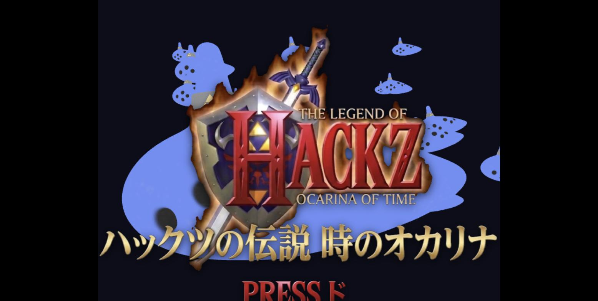 | 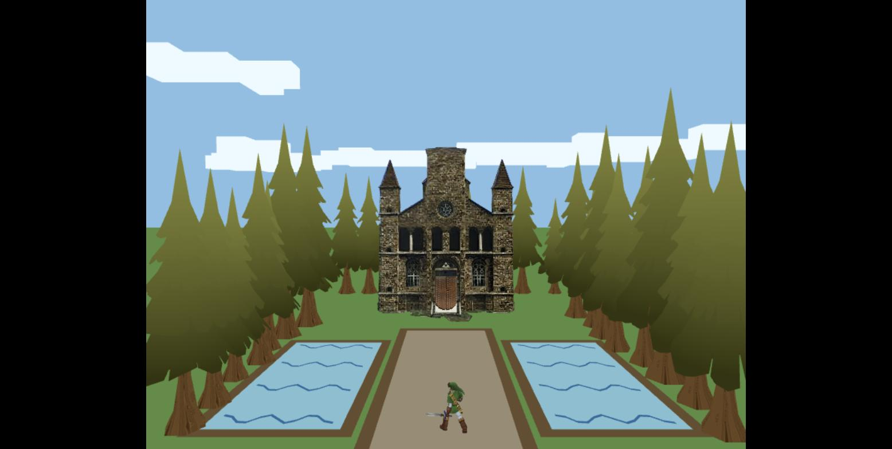 |
| タイトル画面。「ド」を弾く/Oキーで開始する | 神殿フィールド。奥の扉は閉まった状態。「時の歌」を演奏する、または`btn-open-door`(デバッグボタン)で開く |

扉が開くと、Linkは操作を待たずに自動で前進して扉をすり抜け、そのまま
次のフィールド(草原)へページ遷移する演出になっている(手動操作は不要)。

### 草原(馬・横視点カメラ)

|  |  |
|---|---|
| 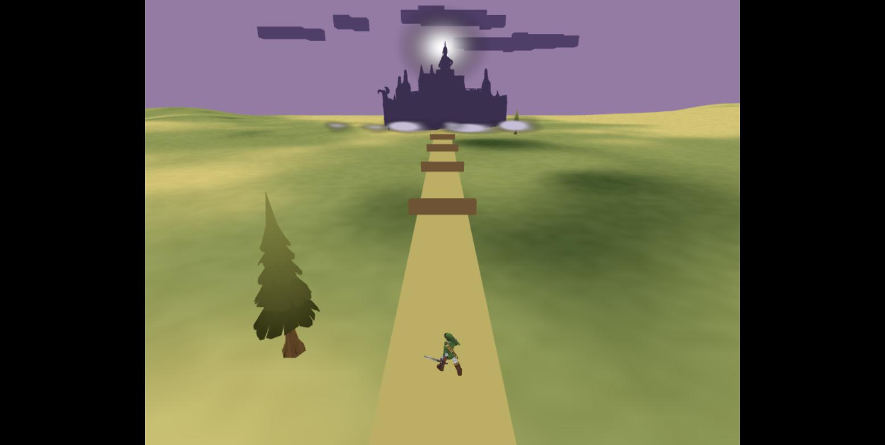 | 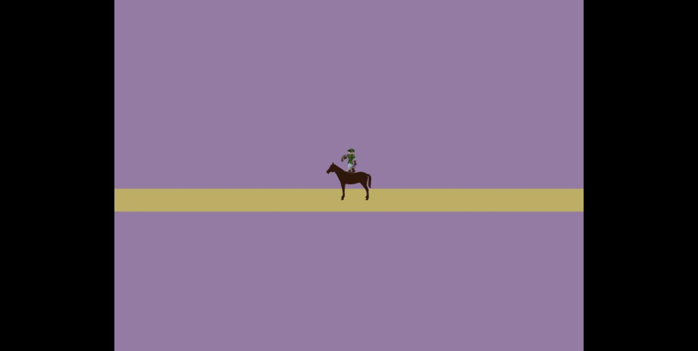 |
| 扉を抜けた直後の草原フィールド。道の奥に城のシルエット、上空に嵐雲・嵐の歌の楽譜HUDらしき装飾が見える | 「馬の歌」を演奏する、または`btn-summon-horse`で馬を召喚。乗ると自動でマリオ的な横視点カメラへ滑らかに遷移し、道中の柵をジャンプ(オタマトーンの低い音、または矢印キー+Oキー相当のジェスチャー)で飛び越える |

### 玉座の間(Ganon第一形態)

|  |  |
|---|---|
| 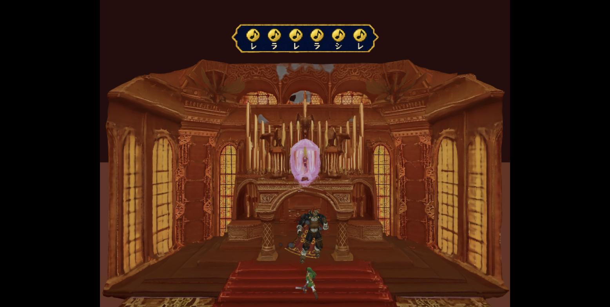 | 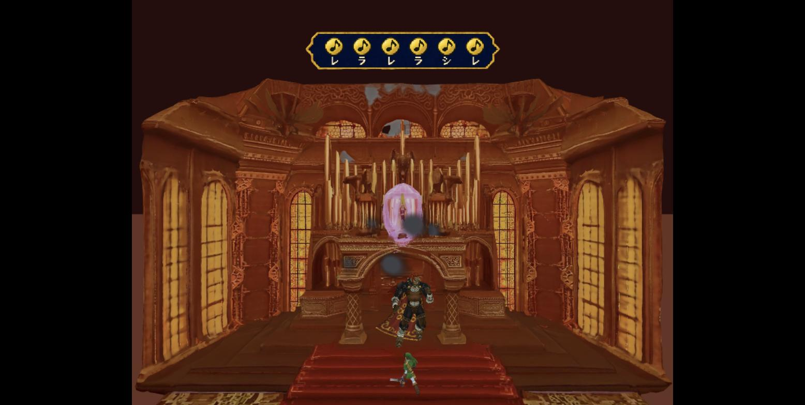 |
| 玉座の間フィールド。奥にGanon第一形態(人型)、上部に「光のプレリュード」の楽譜HUD | 「光のプレリュード」を演奏する、または`btn-defeat-ganon`/`btn-preview-collapse`(デバッグボタン)で撃破演出(煙→崩落→wipe岩)を再生できる |

### 戦場跡(Ganon最終形態、撃破カットシーン)

このカットシーンが今回のセッションで実装したメインの演出。「嵐の歌」を演奏する、
または`btn-defeat-ganon-final`(デバッグボタン)で再生できる。

| 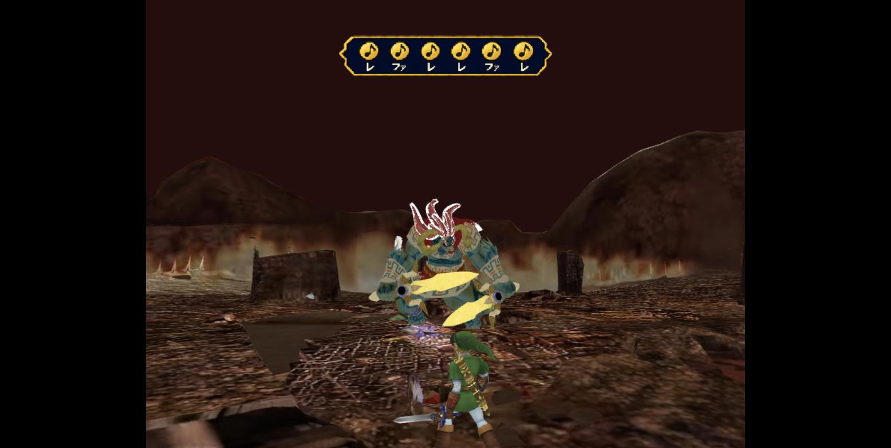 |
|---|
| 通常時。Ganon最終形態(緑色・角のある獣形態)とLink。上部に「嵐の歌」の楽譜HUD |

| 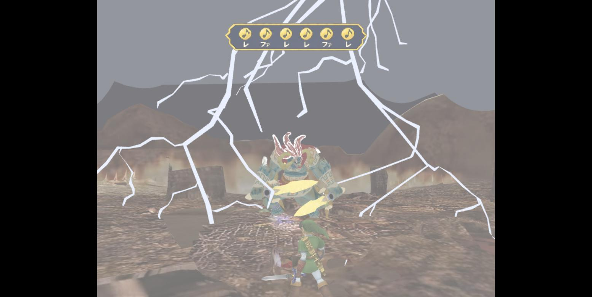 |
|---|
| **雷フェーズ**: 嵐雲が上空を覆い空が暗転した後、画面全体(遠景・フィールド中景・Ganon直撃)に計8本の雷が3回連続で明滅する |

| 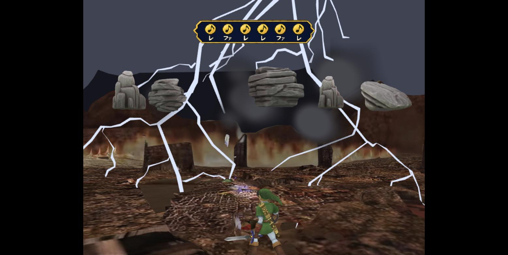 |
|---|
| **爆発フェーズ**: 大きな閃光と同時にGanon本体を実際に画面外へ退避させ(=消える)、煙玉8個・岩片8個を外側へ飛び散らせる |

この後、白フェード→`ending.html`(静的ページ)へページ遷移する。

### エンディング

| 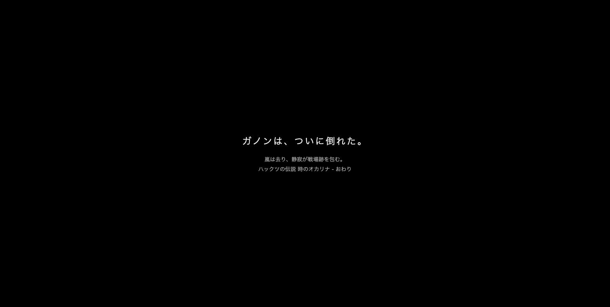 |
|---|
| 全フィールドクリア後にたどり着く静的なエンディングページ(`web/ending.html`) |

### 操作パネル(共通UI)

| 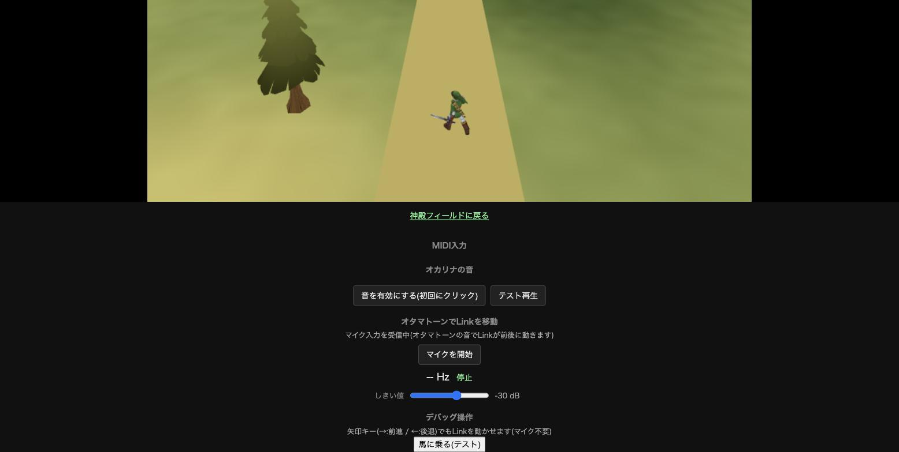 |
|---|
| 各フィールドのcanvas下部に共通で並ぶ操作パネル。上から「MIDI入力」の状態表示、「オカリナの音」(効果音有効化・テスト再生)、「オタマトーンでLinkを移動」(マイク開始・検出周波数・しきい値スライダー)、「デバッグ操作」(矢印キー操作の案内+そのフィールド固有のデバッグボタン、この例では草原の「馬に乗る(テスト)」) |
